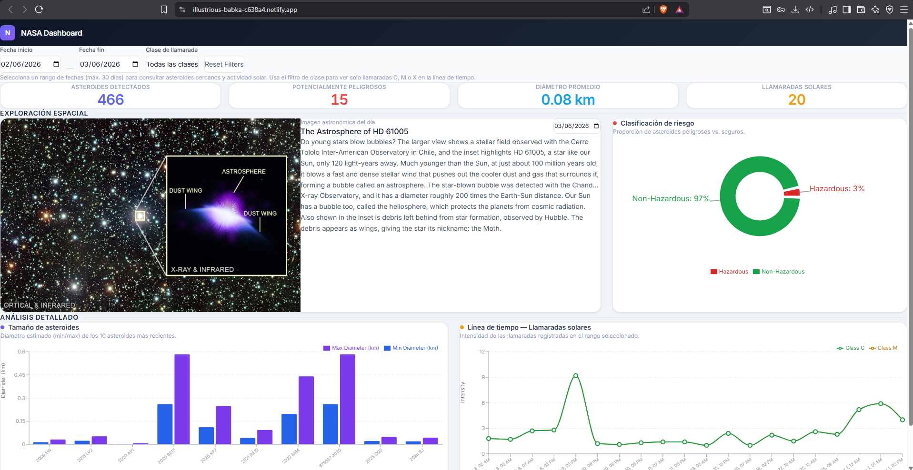
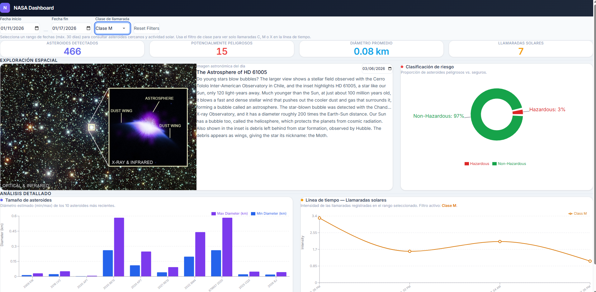
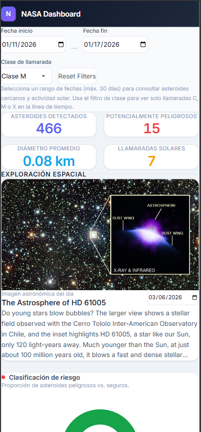

# NASA Dashboard

Dashboard interactivo construido con **React 19** y **TypeScript** que consume tres APIs públicas de NASA para visualizar asteroides cercanos a la Tierra (NEO), llamaradas solares (DONKI FLR) y la imagen astronómica del día (APOD).

## Demostración en vivo

> **URL:** [https://illustrious-babka-c638a4.netlify.app](https://illustrious-babka-c638a4.netlify.app)

## Capturas de pantalla

| Estado | Captura |
|--------|---------|
| Carga inicial (30 días por defecto) |  |
| Después de aplicar filtros de fecha y clase |  |
| Vista móvil |  |

---

## Cómo configurar y ejecutar la aplicación

### Requisitos previos

- **Node.js** ≥ 18
- **npm** ≥ 9

### Instalación

```bash
git clone <repo-url>
cd DashboardInteractivo
npm install
```

### Configurar API key de NASA (recomendado)

Sin configuración se usa `DEMO_KEY`, que tiene un límite de **30 peticiones por hora**. Para uso real se recomienda obtener una key gratuita en [api.nasa.gov](https://api.nasa.gov) (1000 req/hora):

```bash
# Crear archivo .env en la raíz del proyecto
echo "VITE_NASA_API_KEY=tu_api_key_aqui" > .env
```

### Comandos disponibles

| Comando | Descripción |
|---------|-------------|
| `npm run dev` | Servidor de desarrollo con HMR (Vite) |
| `npm run build` | Compila TypeScript y genera build de producción en `dist/` |
| `npm run preview` | Sirve el build de producción localmente |
| `npm run lint` | Ejecuta ESLint sobre el código fuente |
| `npm run format` | Formatea el código con Prettier |
| `npm test` | Ejecuta los tests unitarios con Jest |
| `npm run test:coverage` | Tests con reporte de cobertura |

### Ejecución rápida

```bash
npm install
npm run dev
# Abrir http://localhost:5173
```

---

## Enfoque adoptado

### Arquitectura

La aplicación sigue una arquitectura por capas:

```
src/
├── pages/            → Dashboard (página principal, estado global de filtros)
├── components/
│   ├── charts/       → AsteroidSizeBarChart, NeoHazardPieChart, SolarFlareTimelineChart
│   └── filters/      → DateRangePicker, EventTypeSelector, ResetFiltersButton
├── hooks/            → useApod, useNeoFeed, useSolarFlares, useDebounce
├── services/         → Cliente HTTP centralizado (nasaApi.ts, constants.ts)
├── types/            → Interfaces TypeScript para cada endpoint de NASA
├── utils/            → Cache en memoria (apiCache.ts), parser de errores (errorHandler.ts)
└── __tests__/        → 6 suites, 32 tests unitarios
```

### Flujo de datos

1. El usuario selecciona un rango de fechas en el `DateRangePicker` (máximo **30 días**).
2. Los valores pasan por un **debounce de 600ms** para evitar llamadas mientras se ajustan las fechas.
3. Los hooks `useNeoFeed` y `useSolarFlares` disparan las peticiones usando `fetchFromNasa()`.
4. El endpoint NEO Feed tiene un límite de 7 días por petición. El hook `useNeoFeed` divide automáticamente rangos mayores en **chunks de 7 días** y los ejecuta **secuencialmente**.
5. Los resultados alimentan 3 gráficos (Recharts) y 4 tarjetas de métricas.
6. El componente APOD tiene su propio selector de fecha independiente.

### Secciones del dashboard

| Sección | Descripción |
|---------|-------------|
| **Header** | Barra superior fija con indicador animado de carga |
| **Filtros** | Selector de rango de fechas (máx. 30 días), filtro por clase de llamarada (C/M/X), botón de reset |
| **Métricas** | 4 tarjetas: asteroides detectados, potencialmente peligrosos, diámetro promedio, llamaradas solares |
| **APOD** | Imagen Astronómica del Día con título, descripción, créditos y selector de fecha propio |
| **Clasificación de riesgo** | PieChart — proporción de asteroides peligrosos vs. no peligrosos |
| **Tamaño de asteroides** | BarChart — diámetro estimado (min/max) de los 10 asteroides más recientes |
| **Línea de tiempo solar** | LineChart — intensidad de llamaradas solares en el rango, con líneas coloreadas por clase (C verde, M naranja, X rojo) |

### APIs consumidas

| Endpoint | URL | Datos |
|----------|-----|-------|
| **APOD** | `GET /planetary/apod` | Imagen astronómica del día con metadatos |
| **NEO Feed** | `GET /neo/rest/v1/feed` | Asteroides cercanos en un rango de fechas (máx. 7 días por petición) |
| **DONKI FLR** | `GET /DONKI/FLR` | Llamaradas solares registradas en un rango de fechas |

Documentación oficial: [api.nasa.gov](https://api.nasa.gov)

### Optimizaciones de red

| Estrategia | Detalle |
|------------|---------|
| **Cache en memoria** | Respuestas almacenadas en `Map` con TTL de 15 minutos. Mismos parámetros = cero peticiones. |
| **Debounce 600ms** | Los filtros de fecha esperan 600ms de inactividad antes de disparar fetch. |
| **Deduplicación** | Si la misma URL ya está en vuelo, se reutiliza la promesa existente. |
| **Retry con backoff** | HTTP 429 (rate limit) se reintenta hasta 3 veces con delays de 1.5s → 3s → 6s. |
| **AbortController** | Al cambiar filtros o desmontar componentes, las peticiones pendientes se cancelan. |
| **Lazy loading** | Los 3 gráficos se cargan con `React.lazy()` + `Suspense`, reduciendo el bundle inicial. |

### Stack tecnológico

| Tecnología | Versión | Uso |
|------------|---------|-----|
| React | 19.2 | UI con hooks y Suspense |
| TypeScript | 5.9 | Tipado estático |
| Vite | 7.3 | Bundler y dev server |
| Recharts | 3.8 | Gráficos (BarChart, PieChart, LineChart) |
| Tailwind CSS | 4.2 | Estilos utility-first (via `@tailwindcss/vite`) |
| Jest | 30.2 | Test runner |
| Testing Library | 16.3 | Tests de componentes React |
| ESLint | 9.39 | Linting |
| Prettier | 3.8 | Formateo de código |

### Accesibilidad

- Enlace "Skip to content" para navegación por teclado
- Roles ARIA en gráficos (`role="img"` con `aria-label` descriptivo), filtros (`role="group"`) y regiones (`role="banner"`, `role="contentinfo"`)
- Validación de fechas con `aria-invalid` y `aria-describedby`
- Focus visible con outline en todos los elementos interactivos
- Región `aria-live="polite"` que anuncia el conteo de asteroides y llamaradas al terminar la carga

---

## Supuestos realizados

- La UI está en **español**, pero los textos internos de gráficos (leyendas, ejes) y mensajes de error están en **inglés** ya que no se especificó un idioma obligatorio.
- Se asume que el usuario tiene acceso a internet para consultar las APIs de NASA en tiempo real.
- La `DEMO_KEY` es suficiente para uso durante evaluación (30 req/hora). El dashboard no implementa persistencia entre sesiones — los datos se pierden al recargar.

## Problemas conocidos

### Rendimiento

- **Carga lenta con rangos de 30 días**: El rango por defecto es de 30 días. El endpoint NEO Feed limita a 7 días por petición, por lo que un rango de 30 días genera **5 peticiones secuenciales** (no paralelas). Esto puede tardar **5–15 segundos** dependiendo de la velocidad de la API. Durante ese tiempo, el dashboard muestra skeletons de carga.
- **Sin paginación de asteroides**: Se muestran solo los 10 más recientes en el BarChart. Con rangos largos pueden haber cientos de asteroides en memoria que no se visualizan.

### Gráfico de llamaradas solares

- **LineChart con datos discretos**: El gráfico de llamaradas solares usa un `LineChart` (Recharts) donde cada evento es un punto. Todas las `<Line>` comparten el mismo `dataKey="intensity"`, lo que causa que si hay múltiples clases (C, M, X), las líneas se superponen y dibujan los mismos puntos. Un `ScatterChart` sería más apropiado para datos de eventos discretos.
- **Eje X categórico**: El eje X se basa en etiquetas de texto (`time` formateadas), no en timestamps numéricos. Esto significa que los puntos se distribuyen uniformemente sin respetar la distancia temporal real entre eventos.

### API de NASA

- **DONKI FLR puede devolver 503**: La API DONKI (llamaradas solares) ocasionalmente devuelve HTTP 503 (Service Unavailable). El sistema actual **no reintenta errores 5xx**, solo reintenta 429 (rate limit). Un 503 resulta en un error inmediato sin posibilidad de recuperación automática.
- **`DEMO_KEY` muy limitada**: 30 peticiones por hora se agotan rápido con rangos largos + recargas. Una vez alcanzado el límite, todas las peticiones fallan con 429 y el dashboard queda inutilizable hasta que pase la hora.
- **La función `wait()` no respeta AbortSignal**: Entre reintentos de 429, la función `wait()` no se cancela si el componente se desmonta o los filtros cambian. Esto puede causar peticiones "fantasma" que se ejecutan después de que ya no son necesarias.

### UI/UX

- **Etiquetas del PieChart se cortan**: Con contenedores pequeños, las etiquetas "Hazardous" y "Non-Hazardous" del gráfico circular pueden truncarse visualmente ("Hazardou...").
- **Sin estado de error visible para el usuario**: Los errores de API se capturan en los hooks (`error` state) pero el dashboard no muestra un banner o mensaje de error visible — simplemente deja de cargar datos sin explicación para el usuario.
- **No hay indicador de "sin datos"** a nivel de sección: Si un rango de fechas no tiene asteroides o llamaradas, el gráfico muestra un texto pequeño "No data available" sin mayor contexto.
- **`lang="en"` en HTML pero contenido en español**: El atributo `lang` del `<html>` es `"en"` pero la UI está mayormente en español, lo que confunde a lectores de pantalla.

### Testing

- **Cobertura parcial**: Solo 6 de los ~15 módulos tienen tests unitarios (32 tests). Faltan tests para: `NeoHazardPieChart`, `SolarFlareTimelineChart`, `EventTypeSelector`, `ResetFiltersButton`, `ErrorBoundary`, `LoadingSkeleton`, `useApod`, `useNeoFeed`, `useSolarFlares`, y `nasaApi.ts`.
- **Sin tests de integración**: No hay tests que verifiquen el flujo completo del dashboard (filtros → fetch → renderizado de gráficos).

---

## Despliegue

La demo está desplegada en Netlify: [https://illustrious-babka-c638a4.netlify.app](https://illustrious-babka-c638a4.netlify.app)

Para redesplegar tras cambios:

```bash
npm run build
npx netlify-cli deploy --prod --dir=dist
```


